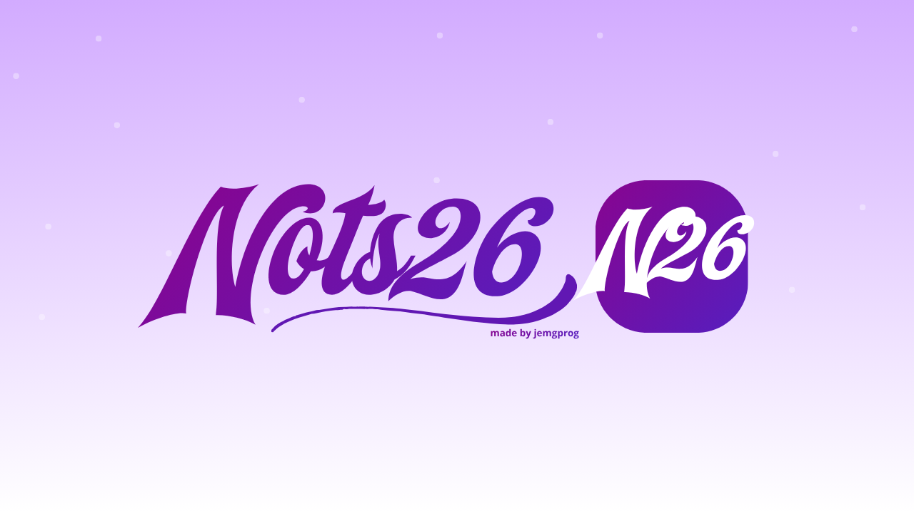

# Nots26

<div align="center">
  
  <p>
    Herramienta web de notas visuales para crear, organizar, mover y conectar ideas dentro de un canvas interactivo.
  </p>
</div>

## Capturas de funcionamiento

> Coloca las capturas finales en `Documents/screenshots/` y reemplaza estas rutas cuando esten listas.

| Canvas principal | Menu contextual | Sidebar y filtros |
| --- | --- | --- |
| `Documents/screenshots/canvas-principal.png` | `Documents/screenshots/menu-contextual.png` | `Documents/screenshots/sidebar-filtros.png` |

## Estado actual

Nots26 se encuentra en version MVP con la Iteracion 2 completada. Actualmente permite:

- Crear notas de texto, tareas e ideas.
- Editar titulo, contenido, tipo, color y tags de cada nota.
- Mover notas libremente dentro del canvas.
- Conectar notas entre si mediante React Flow.
- Eliminar notas y limpiar el workspace.
- Buscar notas por titulo, contenido o tags.
- Filtrar por tipo de nota: texto, tarea o idea.
- Contraer y expandir el sidebar.
- Guardar automaticamente el workspace en `localStorage`.

## Requisitos

- Node.js 20 o superior.
- npm 10 o superior.
- Navegador moderno compatible con React y APIs actuales de JavaScript.

En Windows, si PowerShell bloquea `npm`, usa `npm.cmd`.

## Instalacion

```bash
npm install
```

En Windows:

```bash
npm.cmd install
```

## Ejecutar en desarrollo

```bash
npm run dev
```

En Windows:

```bash
npm.cmd run dev
```

Luego abre la URL local que muestre Vite, normalmente:

```text
http://127.0.0.1:5173
```

## Compilar para produccion

```bash
npm run build
```

En Windows:

```bash
npm.cmd run build
```

La salida compilada queda en `dist/`.

## Como usar Nots26

### Crear notas

- Usa el boton `+` de la barra superior para crear una nota.
- Haz click derecho sobre el canvas para abrir el menu contextual.
- Haz doble click en un espacio vacio del canvas para abrir el mismo menu.
- Desde el menu contextual puedes crear notas de tipo texto, tarea o idea.

### Editar notas

Cada nota permite modificar:

- Titulo.
- Contenido.
- Tipo de nota.
- Color.
- Tags separados por coma.
- Estado pendiente/completada cuando la nota es una tarea.

### Mover y organizar

- Arrastra una nota para cambiar su posicion.
- El canvas usa `snap-to-grid` para ayudar a ordenar visualmente los elementos.
- Usa zoom y pan con los controles de React Flow.
- Contrae el sidebar para ampliar el espacio disponible del canvas.

### Conectar notas

- Arrastra desde el handle inferior de una nota hacia otra nota para crear una conexion.
- Las conexiones se guardan junto con el workspace.
- Al eliminar una nota, tambien se eliminan sus conexiones asociadas.

### Buscar y filtrar

- Usa el buscador del sidebar para encontrar notas por titulo, contenido o tags.
- Usa los filtros de tipo para mostrar texto, tareas o ideas.
- Haz click en un tag del sidebar para filtrar rapidamente por esa etiqueta.

### Persistencia

El workspace se guarda automaticamente en `localStorage` bajo la clave:

```text
nots26.workspace.v1
```

Esto significa que las notas, posiciones, conexiones y contenido se conservan al recargar la pagina en el mismo navegador.

## Estructura principal

```text
src/
  components/
    CanvasContextMenu.tsx
    EmptyState.tsx
    NoteNode.tsx
    SidebarPanel.tsx
    Toolbar.tsx
    WorkspaceCanvas.tsx
  types/
    note.ts
  utils/
    id.ts
    storage.ts
  App.tsx
  main.tsx
  styles.css
```

## Comandos utiles

```bash
npm run dev      # inicia Vite en modo desarrollo
npm run build    # valida TypeScript y genera dist/
npm run preview  # sirve el build de produccion localmente
```

## Roadmap cercano

La siguiente etapa recomendada es la Iteracion 3:

- Mejorar seleccion y eliminacion explicita de conexiones.
- Permitir etiquetar o categorizar conexiones.
- Mejorar la visualizacion de relaciones entre notas.
- Preparar historial de cambios y deshacer/rehacer en una iteracion posterior.

## Licencia

Este proyecto esta publicado bajo licencia MIT. Consulta [LICENSE](LICENSE).
